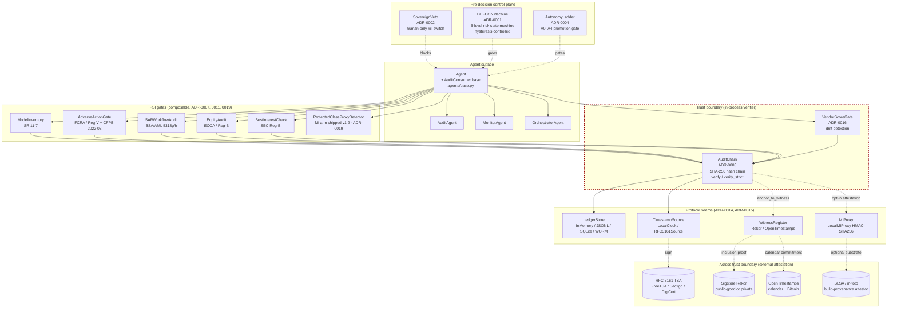

# ARCHITECTURE.md — System-level architecture

**Status:** v1.1.0 · Last reviewed: 2026-05-28.

This document is the one-page view of how the v1.1 modules compose. ADRs hold the per-decision rationale; this document holds the layering.

> Companion to [`FAILURE-MODES.md`](FAILURE-MODES.md), [`LIMITATIONS.md`](LIMITATIONS.md), and the per-decision ADRs in `docs/adr/`.

---

## System diagram

The dashed boundary box is the trust boundary the framework defends by default. Anchoring to a witness crosses the boundary; that is the design intent of ADR-0014.

---

## Layering

1. **Pre-decision control plane** — `SovereignVeto`, `DEFCONMachine`, `AutonomyLadder`. These three gate whether the agent gets to run at all. They are the architecture's "no" mechanisms: a clear veto stops the call; a state above ALERT throttles or halts; an autonomy tier above the configured ceiling refuses the action.

2. **Agent surface** — `Agent` and `AuditConsumer` in `finserv_agent_audit.agents.base`. The `AuditConsumer` base accepts the four Protocol seams + an optional `VendorScoreGate` through one injection contract. Reference agents (`AuditAgent`, `MonitorAgent`, `OrchestratorAgent`) demonstrate wiring; production deployers subclass `Agent` and reuse the consumer surface.

3. **FSI gates** — six modules (`ModelInventory`, `AdverseActionGate`, `SARWorkflowAudit`, `EquityAudit`, `BestInterestCheck`, `ProtectedClassProxyDetector`) that emit structured `AuditEvent`s into the chain. They are composable: an agent that issues credit calls `AdverseActionGate` and `EquityAudit`; an agent that recommends securities calls `BestInterestCheck`; an agent supporting the BSA function calls `SARWorkflowAudit`. `ProtectedClassProxyDetector` shipped the mutual-information arm in v1.2 (closing the v1.1 deferral per ADR-0019); SHAP and conditional-demographic-disparity arms remain on the v1.3 roadmap.

4. **Trust boundary** — `AuditChain` and `VendorScoreGate` operate inside the in-process trust boundary. `AuditChain.verify()` confirms hash-chain integrity; `verify_strict()` adds sequence-monotonicity and optional MIProxy attestation. `VendorScoreGate.record_score()` writes per-call entries and raises `VendorScoreDriftDetected` on the `(vendor_id, input_hash, model_version)` collision.

5. **Protocol seams** — four Protocols (`LedgerStore`, `TimestampSource`, `WitnessRegister`, `MIProxy`) let the deployer wire the substrate their compliance posture requires. Defaults are in-process (InMemory + LocalClock + no witness + LocalMIProxy) so test suites and demos run with zero infrastructure. Production deployers wire SQLite / JSONL / WORM ledger backends, RFC 3161 timestamps, Rekor / OpenTimestamps witnesses, and substrate-attested MIProxy backends.

6. **Across the trust boundary** — external attestation services. The framework does not ship clients for these; the seam contract is the interface, and reference adapter shapes are in `examples/`. The TSA, Rekor, OpenTimestamps calendar, and a SLSA / in-toto attestor live outside the in-process trust boundary by design.

---

## Data-flow paragraph

A typical FSI agent call flows: pre-decision gates (`SovereignVeto.is_clear()` → `DEFCONMachine.current_level()` → `AutonomyLadder.check_a2_to_a3_promotion()`) → agent reasoning → FSI gate(s) appropriate to the decision class (e.g. credit decline calls `AdverseActionGate.evaluate()` and `EquityAudit.check()`; security recommendation calls `BestInterestCheck.check()`; BSA escalation calls `SARWorkflowAudit.record()`) → each gate emits a structured `AuditEvent` via the agent's `AuditConsumer` → `AuditChain.append()` hashes the event with the prior-hash, calls `TimestampSource.now()` for the timestamp, and persists through `LedgerStore.append()`. Asynchronously, a cron job calls `anchor_to_witness(audit_chain, witness)` to write the chain head to Rekor / OpenTimestamps and append a `WITNESS_ANCHOR` entry back into the chain. On verify (operator-triggered or scheduled), `AuditChain.verify_strict(mi_proxy=...)` re-hashes the chain, checks sequence monotonicity, and calls `MIProxy.verify_integrity()` to attest the verifier itself. If any check fails, the verifier raises (`AuditChainTamperError` or `IntegrityVerificationError`) and refuses to return a verified result — the framework is fail-closed on the verify side.

---

## Cross-references

- ADR-0001 — DEFCON state machine
- ADR-0002 — Sovereign Veto
- ADR-0003 — Hash-chain audit
- ADR-0004 — Autonomy Ladder A0–A4
- ADR-0006 — Shadow Mode rollout
- ADR-0007 — SR 11-7 overlay
- ADR-0013 — SEC 17a-4 WORM
- ADR-0014 — Persistence + timestamp + witness pattern
- ADR-0015 — MI Proxy
- ADR-0016 — VendorScoreGate
- ADR-0017 — Audit retention / privilege / discovery
- ADR-0018 — Adversarial agent threat model
- ADR-0019 — ProtectedClassProxyDetector deferred
- [`FAILURE-MODES.md`](FAILURE-MODES.md), [`LIMITATIONS.md`](LIMITATIONS.md), [`ASSURANCE-GUIDE.md`](ASSURANCE-GUIDE.md)
