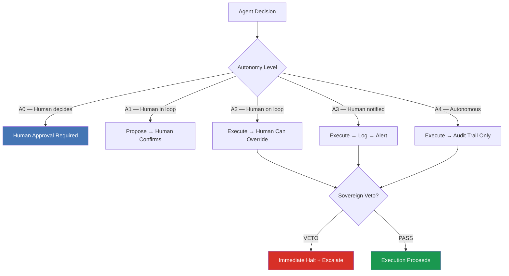
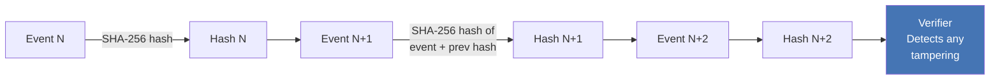

# finserv-agent-audit

**Governance patterns for autonomous AI agents in regulated financial services.**

Extracted from a multi-year build of a 6-agent autonomous trading system — hundreds of engineering sessions, architectural decision records, and documented failure-mode analyses. The source system operates in paper-trading Phase 0; no live capital has been deployed.

[](https://www.python.org/downloads/)
[](LICENSE)
[](CONTRIBUTING.md)
[](https://github.com/linus10x/finserv-agent-audit/actions)

---

## Why this exists

Every team building autonomous AI agents in a regulated environment eventually hits the same wall: the agent does something unexpected, and there is no audit trail, no kill switch, and no governance framework that satisfies a compliance review.

Existing AI safety research focuses on alignment. Existing compliance frameworks focus on humans. Neither addresses the operational reality of an agent that executes hundreds of decisions per day inside a risk-managed financial system.

This repository fills that gap. These are battle-tested patterns — not academic proposals — for teams building agents that must survive a regulatory audit, a risk committee, and a 3am incident.

---

## Architecture Overview

### DEFCON Risk-State Machine

Every agent in a regulated system needs a risk-state machine that degrades gracefully, escalates conservatively, and de-escalates only after sustained confirmation.

```mermaid
stateDiagram-v2
    direction LR
    [*] --> NORMAL

    NORMAL --> CAUTION : drawdown > caution threshold
    CAUTION --> NORMAL : 3 consecutive evals below caution [hysteresis]
    CAUTION --> ALERT : drawdown > alert threshold
    ALERT --> CAUTION : 3 consecutive evals below alert [hysteresis]
    ALERT --> DANGER : drawdown > danger threshold
    DANGER --> ALERT : 3 consecutive evals below danger [hysteresis]
    DANGER --> HALT : drawdown > halt threshold
    HALT --> DANGER : manual override + 3 confirmations only

    NORMAL : NORMAL\nFull execution\nAll strategies active
    CAUTION : CAUTION\nReduced position sizing\nHeightened monitoring
    ALERT : ALERT\nHalf position sizing\nSovereign veto armed
    DANGER : DANGER\nEmergency sizing only\nNew entries blocked
    HALT : HALT\nAll execution suspended\nHuman-in-the-loop required
```



### Sovereign Veto Architecture



### Audit Chain (Tamper-Evident)



---

## Patterns Included

| Pattern | File | Covers |
|---|---|---|
| DEFCON State Machine | `examples/defcon_state_machine.py` | Risk-state degradation with hysteresis |
| Sovereign Veto | `patterns/sovereign_veto.py` | Human-in-the-loop kill switch |
| Audit Chain | `schemas/audit_event.py` | Tamper-evident hash-chain logging |
| Autonomy Ladder | `docs/autonomy_ladder.md` | A0→A4 governance classification |
| EU AI Act Mapping | `docs/eu_ai_act_mapping.md` | Article-by-article control mapping |
| Shadow Mode Rollout | `patterns/shadow_mode.py` | Parallel dry-run before live execution |

---

## Quick Start

```bash
# Clone and install
git clone https://github.com/linus10x/finserv-agent-audit.git
cd finserv-agent-audit
pip install -r requirements.txt

# Run the DEFCON state machine demo
python examples/defcon_state_machine.py

# Run tests
pytest tests/ -v
```

**60 seconds from clone to running demo.** The state machine demo simulates 10 evaluation cycles, prints the DEFCON level at each step, and writes a JSON audit trail to `output/demo_audit.jsonl`.

---

## Who This Is For

- **Engineers** building autonomous agents that execute in regulated environments (trading, lending, insurance, compliance)
- **Risk architects** designing kill-switch and override mechanisms for AI systems
- **Compliance teams** mapping AI agent behavior to EU AI Act, SEC Rule 15c3-5, or SOC 2 requirements
- **CTOs and Chief AI Officers** establishing governance frameworks before regulators ask for them

---

## Author

**Kunjar Bhaduri** — 25+ year FSI technology executive. Rescued a $750M multi-year wealth-management platform deal at Broadridge. Rebuilt production infrastructure on Azure during a 12-day ransomware attack with no DR available. Builder of APEX, a 6-agent autonomous trading research system targeting 67.7% CAGR in Phase 0 paper trading.

[LinkedIn](https://linkedin.com/in/kunjarbhaduri) · [NTCI Portfolio](https://github.com/linus10x)

---

## Contributing

See [CONTRIBUTING.md](CONTRIBUTING.md). This repository exists because the failure modes that produced these patterns are real — and the teams dealing with them rarely have reference implementations to work from.

## License

MIT — see [LICENSE](LICENSE).

## Citation

If you use these patterns in your systems or research, please cite using [CITATION.cff](CITATION.cff).
