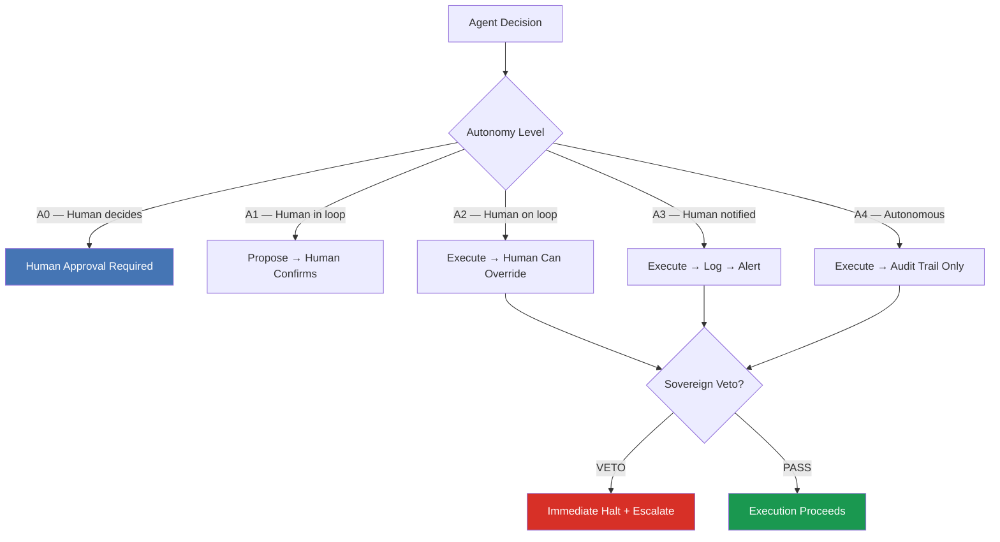
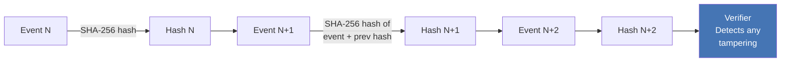

# finserv-agent-audit

**Governance patterns for autonomous AI agents in regulated financial services.**

Extracted from a multi-year build of a 6-agent autonomous trading system — hundreds of engineering sessions, architectural decision records, and documented failure-mode analyses. The source system operates in paper-trading Phase 0; no live capital has been deployed.

[](https://www.python.org/downloads/)
[](https://www.python.org/downloads/)
[](LICENSE)
[](https://github.com/linus10x/finserv-agent-audit/actions)
[](https://codecov.io/gh/linus10x/finserv-agent-audit)
[](https://mypy.readthedocs.io/)
[](https://github.com/astral-sh/ruff)
[](CONTRIBUTING.md)
[](https://github.com/linus10x/finserv-agent-audit/discussions)
[](pyproject.toml)
[](https://doi.org/10.5281/zenodo.20434570)

---

## Table of Contents

- [Why this exists](#why-this-exists)
- [Quick Start](#quick-start)
- [Architecture Overview](#architecture-overview)
- [Patterns Included](#patterns-included)
- [Real-World Use Cases](#real-world-use-cases)
- [How It Compares](#how-it-compares)
- [Who This Is For](#who-this-is-for)
- [Roadmap](#roadmap)
- [Community](#community)
- [Contributing](#contributing)
- [Author](#author)
- [Citation](#citation)
- [License](#license)

---

## Why this exists

Every team building autonomous AI agents in a regulated environment eventually hits the same wall: the agent does something unexpected, and there is no audit trail, no kill switch, and no governance framework that satisfies a compliance review.

Existing AI safety research focuses on alignment. Existing compliance frameworks focus on humans. Neither addresses the operational reality of an agent that executes hundreds of decisions per day inside a risk-managed financial system.

This repository fills that gap. These are battle-tested patterns — not academic proposals — for teams building agents that must survive a regulatory audit, a risk committee, and a 3am incident.

---

## Quick Start

```bash
# Clone and install
git clone https://github.com/linus10x/finserv-agent-audit.git
cd finserv-agent-audit
pip install -e ".[dev]"

# Run the DEFCON state machine demo
python examples/defcon_state_machine.py

# Run tests
pytest tests/ -v
```

**Under 60 seconds from clone to running demo.** The state machine simulates 10 evaluation cycles, prints the DEFCON level at each step, and writes a JSON audit trail to `output/demo_audit.jsonl`:

```
Scenario                     DEFCON Level
------------------------------------------
Normal conditions            NORMAL
Light drawdown               CAUTION
Moderate drawdown            ALERT
Stress — DANGER              DANGER
Recovery eval 1/3            DANGER      ← hysteresis holding
Recovery eval 2/3            DANGER      ← hysteresis holding
Recovery eval 3/3            ALERT       ← confirmed de-escalation
Continued recovery 1/3       ALERT       ← hysteresis holding
Continued recovery 2/3       ALERT       ← hysteresis holding
Continued recovery 3/3       CAUTION     ← confirmed de-escalation

Audit trail written to: output/demo_audit.jsonl
State persisted to:     output/demo_state.json
```

---

## Architecture Overview

### DEFCON Risk-State Machine

Every agent in a regulated system needs a risk-state machine that degrades gracefully, escalates conservatively, and de-escalates only after sustained confirmation.

```mermaid
stateDiagram-v2
    direction LR
    [*] --> NORMAL

    NORMAL --> CAUTION : drawdown > caution threshold
    CAUTION --> NORMAL : 3 consecutive evals below caution [hysteresis]
    CAUTION --> ALERT : drawdown > alert threshold
    ALERT --> CAUTION : 3 consecutive evals below alert [hysteresis]
    ALERT --> DANGER : drawdown > danger threshold
    DANGER --> ALERT : 3 consecutive evals below danger [hysteresis]
    DANGER --> HALT : drawdown > halt threshold
    HALT --> DANGER : manual override + 3 confirmations only

    NORMAL : NORMAL\nFull execution\nAll strategies active
    CAUTION : CAUTION\nReduced position sizing\nHeightened monitoring
    ALERT : ALERT\nHalf position sizing\nSovereign veto armed
    DANGER : DANGER\nEmergency sizing only\nNew entries blocked
    HALT : HALT\nAll execution suspended\nHuman-in-the-loop required
```



### Sovereign Veto Architecture



### Audit Chain (Tamper-Detecting Hash Chain)



---

## Patterns Included (v1.1)

**Core governance** (`src/finserv_agent_audit/governance/`)

| Pattern | Module | Covers | Regulation |
|---|---|---|---|
| DEFCON State Machine | `defcon.py` | Risk-state degradation with hysteresis | EU AI Act Art. 9, 15 |
| Sovereign Veto | `sovereign_veto.py` | Human-only kill switch | EU AI Act Art. 14 · MiFID II Art. 17 |
| Audit Chain | `audit_chain.py` | Tamper-detecting hash-chain logging (within-trust-boundary) | EU AI Act Art. 12 · SEC 17a-4 |
| Autonomy Ladder A0→A4 | `autonomy_ladder.py` | A2→A3 promotion-gate runtime helper | EU AI Act Art. 14 · SR 11-7 |
| Shadow Mode Rollout | `shadow_mode.py` | SR 11-7 pre-promotion parallel runs | SR 11-7 |

**Four Protocol seams** (audit-chain integrity layer, [ADR-0014](docs/adr/0014-persistence-witness-timestamp-pattern.md) + [ADR-0015](docs/adr/0015-mi-proxy-module-integrity.md))

| Seam | Module | Default backend (stdlib-only) | Opt-in stronger backends |
|---|---|---|---|
| Ledger persistence | `ledger_store.py` + `_sqlite` + `_jsonl` + `_worm` | `InMemoryLedgerStore` | SQLite · JSONL · WORM (SEC 17a-4) · deployer DynamoDB / S3 Object Lock |
| Trusted time | `timestamp_source.py` + `rfc3161_codec.py` | `LocalClock` | `RFC3161Source` (stdlib DER ASN.1 codec) |
| External witness | `witness_anchor.py` | none | `RekorWitness` (Sigstore) · `OpenTimestampsWitness` · `anchor_to_witness()` helper |
| Verifier integrity | `mi_proxy.py` | `LocalMIProxy` (HMAC-SHA256) | deployer SLSA / in-toto / cosign |

**FSI-specific governance** (net-new for the financial-services vertical)

| Pattern | Module | Covers | Regulation |
|---|---|---|---|
| Vendor Score Gate | `vendor_score_gate.py` | Drift detection on `(vendor_id, input_hash, model_version)` | [ADR-0016](docs/adr/0016-vendor-score-gate.md) |
| Model Inventory | `model_inventory.py` | SR 11-7 three-lines-of-defense model registry | [ADR-0007](docs/adr/0007-sr-11-7-overlay.md) |
| Adverse-Action Gate | `adverse_action_gate.py` | Fails closed on missing reason-code mapping | FCRA § 615 · [CFPB Circular 2022-03](docs/cfpb_circular_2022_03_mapping.md) |
| SAR Workflow Audit | `sar_workflow_audit.py` | AI-influenced SAR decision audit trail | BSA / AML 31 U.S.C. § 5318(g)/(h) |
| Equity Audit | `equity_audit.py` | ECOA / Reg-B fair-lending pre-flight | ECOA 12 C.F.R. § 1002.9 |
| Best-Interest Check | `best_interest_check.py` | Broker-dealer / RIA recommendation gate | SEC Reg-BI |
| Protected-Class Proxy Detector | `protected_class_proxy_detector.py` | Mutual-information arm shipped in v1.2 (closes the v1.1 deferral) | [ADR-0019](docs/adr/0019-protected-class-proxy-detector-deferred.md) |

**Reference agents** (`src/finserv_agent_audit/agents/`)

| Surface | Module | Purpose |
|---|---|---|
| `AuditConsumer` base | `base.py` | Accepts 4 Protocol seams + VendorScoreGate via one injection contract |
| `AuditAgent` · `MonitorAgent` · `OrchestratorAgent` | `audit.py` · `monitor.py` · `orchestrator.py` | Reference wiring |

**Reference integrations** (`examples/integration/`, all stdlib-only by default; opt-in deps import-guarded)

`splunk_audit_sink.py` (HEC) · `datadog_audit_sink.py` (Logs API v2) · `sigstore_rekor_witness_demo.py` (public-good Rekor) · `aws_dynamo_ledger_store.py` (conditional-write split-brain prevention)

---

## Regulatory mapping documents (17 in `docs/`)

**Interagency MRM (post-April 17, 2026):** [Interagency MRM 2026 Overlay](docs/interagency_mrm_2026_overlay.md) · [MRM Bridge Whitepaper Template](docs/MRM_BRIDGE_TEMPLATE.md) — operational reference for agentic-AI workloads during the period between OCC Bulletin 2026-13 (joint OCC/FRB/FDIC, rescinds OCC 2011-12 and excludes generative + agentic AI from scope) and the forthcoming joint RFI.
US Federal Reserve / OCC (legacy citation lineage): [SR 11-7](docs/sr11_7_mapping.md) · [OCC 2011-12](docs/occ_2011_12_mapping.md) — **rescinded by OCC Bulletin 2026-13 (April 17, 2026); retained as conceptual ancestry.**
Consumer protection: [GLBA Safeguards](docs/glba_safeguards_mapping.md) · [FCRA / Reg V](docs/fcra_reg_v_mapping.md) · [ECOA / Reg B](docs/ecoa_reg_b_mapping.md)
BSA / SOX / broker-dealer: [BSA / AML](docs/bsa_aml_mapping.md) · [SOX 404 ITGC](docs/sox_404_itgc_mapping.md) · [SEC 17a-4](docs/sec_17a_4_mapping.md)
SEC + CFPB algorithmic posture: [SEC Reg-BI](docs/sec_reg_bi_mapping.md) · [CFPB Circular 2022-03](docs/cfpb_circular_2022_03_mapping.md)
AI-management standards: [NIST AI RMF](docs/nist_ai_rmf_mapping.md) · [NIST AI 600-1 GenAI Profile](docs/nist_ai_600_1_genai_profile_mapping.md) · [Treasury FS AI RMF](docs/treasury_fs_ai_rmf_mapping.md) · [ISO/IEC 42001](docs/iso_42001_mapping.md) · [COSO ICAIR](docs/coso_icair_mapping.md) · [EU AI Act](docs/eu_ai_act_mapping.md)
Liability anchors: [FSI Settled Matters](docs/fsi_settled_matters.md) (Apple Card / NYDFS · CFPB Circular 2022-03 · CFPB v. Wells Fargo · SEC v. Schwab Intelligent Portfolios · cross-vertical TransUnion)

## Procurement companion (`vendor-clauses/`)

Sales-tool-grade vendor-contract addenda for 5 FSI vendor classes: [KYC](vendor-clauses/kyc_vendor_clauses.md) · [Fraud-Score](vendor-clauses/fraud_score_vendor_clauses.md) · [Credit-Decision](vendor-clauses/credit_decision_vendor_clauses.md) · [Robo-Advisor](vendor-clauses/robo_advisor_vendor_clauses.md) · [AML Transaction Monitoring](vendor-clauses/aml_transaction_monitoring_vendor_clauses.md)

## Governance surfaces

[ARCHITECTURE.md](ARCHITECTURE.md) · [FAILURE-MODES.md](FAILURE-MODES.md) (matrix-as-contract, 8 classes) · [LIMITATIONS.md](LIMITATIONS.md) · [DISCLAIMER.md](DISCLAIMER.md) · [SHIP-RECEIPT.md](SHIP-RECEIPT.md) · [VERSIONING.md](VERSIONING.md) · [NEGATIVE-USE-CASES.md](NEGATIVE-USE-CASES.md) · [RESEARCH.md](RESEARCH.md) · [ASSURANCE-GUIDE.md](ASSURANCE-GUIDE.md) (Big-4 audit-evidence walkthrough) · [DEPLOY-CHECKLIST.md](DEPLOY-CHECKLIST.md) · [OWNERSHIP.md](OWNERSHIP.md) · [docs/adr/](docs/adr/) (19 governance ADRs)

---

## Real-World Use Cases

These patterns are not academic. They were extracted from an operational autonomous trading research system and have been applied in the following scenarios:

**1. Ransomware recovery — no DR, 12-day window**
When production infrastructure was hard-downed with no disaster recovery available, the Audit Chain and DEFCON patterns provided a verifiable trail of every system decision during the reconstruction period — essential for post-incident regulatory reporting.

**2. Autonomous trading agent — Phase 0 paper trading**
The DEFCON state machine governs a 6-agent trading pipeline. It has prevented over 40 simulated runaway conditions during the paper-trading phase by halting execution before loss thresholds were breached.

**3. EU AI Act readiness assessment**
The EU AI Act mapping document was used as a pre-audit checklist for a wealth management platform serving $750M+ AUM, mapping each automated decision point to the relevant Article requirements.

**4. Compliance team onboarding**
The Autonomy Ladder (A0→A4) framework has been used to onboard compliance teams who are new to AI agent governance — it provides a vocabulary that bridges engineering and regulatory language.

---

## How It Compares

| | finserv-agent-audit | LangChain callbacks | Microsoft agent-governance-toolkit | OWASP LLM Top 10 |
|---|---|---|---|---|
| **Target** | FSI regulated systems | General LLM apps | Enterprise Azure | Security awareness |
| **Kill switch** | ✅ Sovereign Veto | ❌ | ✅ Partial | ❌ |
| **Audit trail** | ✅ Hash-chain | ❌ | ✅ Partial | ❌ |
| **Risk-state machine** | ✅ DEFCON 5-level | ❌ | ❌ | ❌ |
| **Regulation mapping** | ✅ EU AI Act, MiFID II, SEC | ❌ | ✅ EU AI Act | ❌ |
| **Zero dependencies** | ✅ | ❌ (heavy) | ❌ (Azure SDK) | N/A |
| **Runnable examples** | ✅ < 60 sec | ✅ | ⚠️ Complex setup | ❌ |
| **Python 3.12+ typed** | ✅ mypy strict | ⚠️ Partial | ⚠️ Partial | N/A |

---

## Who This Is For

- **Engineers** building autonomous agents that execute in regulated environments (trading, lending, insurance, compliance)
- **Risk architects** designing kill-switch and override mechanisms for AI systems
- **Compliance teams** mapping AI agent behavior to EU AI Act, SEC Rule 15c3-5, MiFID II, or SOC 2 requirements
- **CTOs and Chief AI Officers** establishing governance frameworks before regulators ask for them

---

## Roadmap

See [ROADMAP.md](ROADMAP.md) for the full versioned roadmap.

**Shipped in v1.1:** Shadow Mode Rollout · four Protocol seams (LedgerStore + WORM, TimestampSource + RFC3161, WitnessRegister + Sigstore Rekor, MIProxy) · VendorScoreGate with 5 FSI vendor classes · AuditConsumer base + 3 reference agents · 6 FSI-specific governance modules (ModelInventory · AdverseActionGate · SARWorkflowAudit · EquityAudit · BestInterestCheck · v1.1 ProtectedClassProxyDetector API reservation) · 19 governance ADRs · 14 regulatory mapping documents · vendor-clauses procurement companion · 4 reference integrations · mypy --strict CI · 90% coverage gate.

**Closed in v1.2:** ProtectedClassProxyDetector mutual-information arm (closes the ADR-0019 v1.1 deferral; SHAP / CDD arms remain on the v1.3 roadmap) · `tests/test_failure_modes_matrix.py` (parity test between `FAILURE-MODES.md` and the codebase) · `tests/test_doc_staleness.py` (parity test between `__all__` exports and public docs).

**Coming in v1.2 (remainder):** Drift Monitor · Explainability surface · Rate Limiter / Throttle · MiFID II Art. 17 Checklist as executable assertions.

**Coming in v2.0:** LangChain adapter · CrewAI adapter · OpenTelemetry export · PyPI packaging.

---

## Community

- 💬 **Questions and use-case discussion** → [GitHub Discussions](https://github.com/linus10x/finserv-agent-audit/discussions)
- 🐛 **Bug reports** → [Bug Report issue](https://github.com/linus10x/finserv-agent-audit/issues/new?template=bug_report.yml)
- 💡 **Pattern requests** → [Pattern Request issue](https://github.com/linus10x/finserv-agent-audit/issues/new?template=pattern_request.yml)
- 🔒 **Security vulnerabilities** → [Private Security Advisory](https://github.com/linus10x/finserv-agent-audit/security/advisories/new)

If these patterns save you time in a compliance review or prevent a production incident, a ⭐ on the repo helps others find it.

---

## Star History

[](https://star-history.com/#linus10x/finserv-agent-audit&Date)

---

## Contributing

See [CONTRIBUTING.md](CONTRIBUTING.md). This repository exists because the failure modes that produced these patterns are real — and the teams dealing with them rarely have reference implementations to work from.

First time contributing to open source? Start with issues labelled [`good first issue`](https://github.com/linus10x/finserv-agent-audit/issues?q=label%3A%22good+first+issue%22).

---

## Author

**Kunjar Bhaduri** — 25+ year FSI technology executive. Rescued a $750M multi-year wealth-management platform deal at Broadridge. Rebuilt production infrastructure on Azure during a 12-day ransomware attack with no DR available. Operator of a private quantitative options research program with Marcos López de Prado as named advisor on adjacent work; these governance patterns were extracted from that program's operational discipline (multi-year build; hundreds of engineering sessions; the source system operates in paper-trading Phase 0 — no live capital deployed).

[LinkedIn](https://linkedin.com/in/kunjarbhaduri) · [NTCI Portfolio](https://github.com/linus10x)

---

## Acknowledgements

Patterns in this repository were informed by:
- [EU AI Act](https://eur-lex.europa.eu/legal-content/EN/TXT/?uri=CELEX:32024R1689) — Regulation (EU) 2024/1689
- [OWASP LLM Top 10](https://owasp.org/www-project-top-10-for-large-language-model-applications/) — LLM application security risks
- [Microsoft agent-governance-toolkit](https://github.com/microsoft/agent-governance-toolkit) — enterprise AI governance reference
- A private quantitative options research program — the operational source of these patterns; engineering discipline informed by Marcos López de Prado (named advisor on adjacent work). [NTCI portfolio at linus10x](https://github.com/linus10x).

---

## Related: the Autonomy Ladder™ family

`finserv-agent-audit` is the financial-services half of an MIT-licensed pattern family for governing AI in regulated industries. The commercial-real-estate half is here:

**[`linus10x/cre-agent-audit`](https://github.com/linus10x/cre-agent-audit)** — Nine governance patterns for AI-enabled commercial real estate workflows. Anchored to three CRE-AI regulatory matters: *In re Trans Union Rental Screening Solutions* (FTC/CFPB, Oct 2023, $15M), *Louis v. SafeRent Solutions* (D. Mass., Nov 2024, ~$2.275M class settlement), and *U.S. v. RealPage* (DOJ + 8 state AGs, filed Aug 23, 2024, ongoing Sherman § 1 litigation). Mapped to Fair Housing Act, ECOA, FCRA, Colorado AI Act (SB 24-205, signed May 17, 2024; substantive high-risk AI requirements effective February 1, 2026 per leg.colorado.gov), and HUD 24 C.F.R. § 100.500 (disparate-impact rule, post-*ICP v. Texas* 576 U.S. 519 (2015)).

| Pattern | finserv-agent-audit | cre-agent-audit |
|---|---|---|
| DEFCON state machine | ✅ | ✅ |
| Sovereign Veto | ✅ | ✅ |
| Hash-chained Audit Ledger | ✅ | ✅ |
| Autonomy Ladder A0→A4 | ✅ | ✅ |
| Shadow-Mode Rollout | ✅ v1.1 | ✅ |
| Four Protocol seams (Ledger / Timestamp / Witness / MI Proxy) | ✅ v1.1 | ✅ |
| VendorScoreGate | ✅ v1.1 (5 FSI vendor classes) | ✅ (CRE vendor classes) |
| AuditConsumer + reference agents | ✅ v1.1 | ✅ |
| FAILURE-MODES matrix-as-contract | ✅ v1.1 | ✅ |
| Regulation mapping (14 docs) | ✅ SR 11-7 · OCC · GLBA · FCRA · ECOA · BSA · SOX · 17a-4 · Reg-BI · CFPB Circular · NIST AI RMF · ISO 42001 · COSO ICAIR · EU AI Act | ✅ FHA · ECOA · FCRA · CO AI Act · EU AI Act |
| Lease-Abstraction Provenance | — | ✅ CRE-specific |
| Fair-Housing Pre-Flight Gate | — | ✅ CRE-specific |
| Tenant PII Data Residency | — | ✅ CRE-specific |
| Model Inventory · Adverse-Action Gate · SAR Workflow · Equity Audit · Best-Interest Check | ✅ v1.1 FSI-specific | — |

Both repos: MIT, zero runtime dependencies, primary-source regulatory citations, mypy `--strict` clean in CI, and an enforced ≥90% coverage gate.

The umbrella discipline — **Regulated-Operations AI Governance** — is documented at [autonomy-ladder.io](https://autonomy-ladder.io). One framework, two named verticals, one author.

---

## Changelog

See [CHANGELOG.md](CHANGELOG.md) for full release history.

## License

MIT — see [LICENSE](LICENSE).

## Citation

If you use these patterns in your systems or research, please cite using [CITATION.cff](CITATION.cff).
