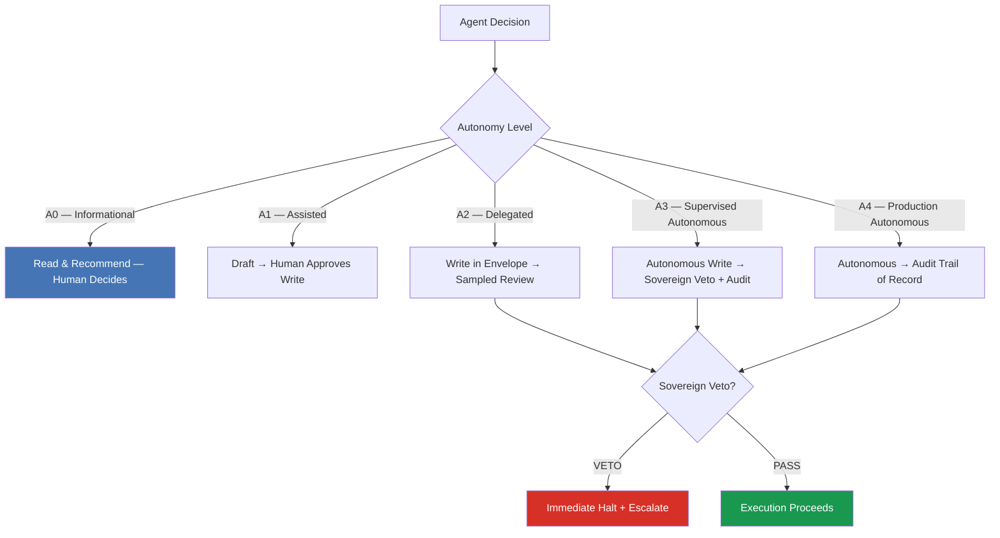
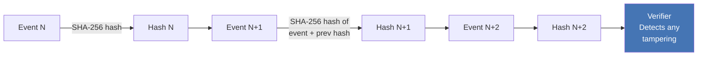

# finserv-agent-audit

**Audit-trail, kill-switch, and model-risk governance for autonomous AI agents in regulated financial services — zero runtime dependencies, examination-ready.**

[](https://github.com/linus10x/finserv-agent-audit/actions/workflows/ci.yml)
[](https://codecov.io/gh/linus10x/finserv-agent-audit)
[](https://github.com/linus10x/finserv-agent-audit/actions/workflows/ci.yml)
[](LICENSE)
[](https://www.python.org/downloads/)
[](https://doi.org/10.5281/zenodo.20434570)
[](https://github.com/linus10x/autonomy-ladder-libraries)

> **What this is:** composable, dependency-free Python governance primitives — a risk-state machine, a non-overridable sovereign veto, a tamper-detecting audit chain, and an A0→A4 autonomy gate — plus FSI-specific controls and primary-source regulatory mappings, for autonomous agents that must survive a regulatory audit, a risk committee, and a 3am incident.
>
> **What this is not:** a model, an agent framework, or legal advice. It governs whatever agent runtime you already run (LangGraph, CrewAI, A2A, Microsoft Agent Framework, or your own) — it does not make decisions; it constrains, records, and proves them.
>
> **Who this is for:** an FSI model-risk / compliance lead who has to produce a defensible per-decision trail on demand — or a frontier-lab / cloud-FSI applied lead who needs the same veto / envelope / audit-chain / demotion primitives on any high-stakes coordinated-autonomy stack, financial or not.

---

## 30-second tour

Zero install, no network — clone and run the demotion-gate demo:

```bash
git clone https://github.com/linus10x/finserv-agent-audit.git
cd finserv-agent-audit
./demo.sh        # grant→examine→revoke, then 3 attacks a hash-chain alone would miss — each caught
```

`./demo.sh` builds an authority lifecycle (an agent is **granted** A3 against evidence, **examined**, then **revoked** to A1 — the revocation recorded against the finding that triggered it), anchors the revoked head to an external witness, then runs three attacks and proves each is caught: a **forged grant with no evidence** (caught by the semantic verifier), a **deleted revocation / head-truncation** (caught by the external-anchor verifier), and an **in-place mutation** (caught by the hash-chain verifier). It exits non-zero if any expected catch fails to fire — a green run is the proof, not the printout. No `pip install`, no credentials, no network.

Full dev setup (the rest of the library):

```bash
pip install -e ".[dev]"

python examples/defcon_state_machine.py        # risk-state machine: NORMAL → HALT with hysteresis
python examples/agent_coordination/coordination.py   # veto / envelope / audit-chain / demotion, domain-agnostic
pytest tests/ -q                               # full suite · mypy --strict clean
```

The DEFCON demo writes a JSON audit trail; the coordination demo prints a hash-chained ledger that ends in `verify() = True`.

> **Receipts:** 630 tests · 93% coverage (≥90% CI gate) · `mypy --strict` clean across 46 source files · 0 runtime dependencies · 34 governance ADRs · 46 regulatory mapping docs · CI runs CodeQL · Bandit · pip-audit · gitleaks · OSV-Scanner on every push, every third-party Action SHA-pinned. Current version: **v2.1.1**.

## Read me first

1. **The best illustrative test** — [`tests/test_sovereign_veto.py`](tests/test_sovereign_veto.py): the kill switch is infrastructure, not a flag. The clearest single proof is that an agent cannot clear its own veto (`test_*self_clear*`) — read that one test and you understand the trust boundary the whole library defends.
2. **[WORKED_EXAMPLE.md](WORKED_EXAMPLE.md)** — a five-beat walkthrough (decision class → agent acts → envelope/veto catches the irreversible action → audit-chain entry → A3→A2 demotion) over the runnable [`examples/agent_coordination/coordination.py`](examples/agent_coordination/coordination.py).
3. **[autonomy-ladder.io](https://autonomy-ladder.io)** — the framework and whitepaper this library implements. The rung-by-rung mapping for *this* repo is in [AUTONOMY_LADDER.md](AUTONOMY_LADDER.md).

## Install

```bash
git clone https://github.com/linus10x/finserv-agent-audit.git
cd finserv-agent-audit
pip install -e .            # governance core, zero runtime dependencies
# optional extras: [dev] [test-property] [api] [a2a] [langgraph] [maf] [crewai] [all-agentic]
```

---

## The wall every team hits

You ship an autonomous agent into a regulated workflow. It runs fine for weeks. Then it does something unexpected — a runaway position, an adverse-action decision with no reason code, a customer commitment it had no authority to make — and the compliance review asks three questions you cannot answer: *Where is the audit trail? Where is the kill switch? Where is the governance framework a regulator will accept?*

AI-safety research answers alignment. Compliance frameworks govern humans. Neither addresses the operational reality of an agent making hundreds of decisions a day inside a risk-managed financial system.

This repository is that missing layer — battle-tested governance patterns extracted from a multi-year build of a six-agent autonomous program, not academic proposals, for teams whose agents must survive a regulatory audit, a risk committee, and a 3am incident.

### What this is — and what it is not

- **It is** a set of composable, dependency-free Python governance primitives (risk-state machine, sovereign veto, tamper-detecting audit chain, autonomy-ladder gating) plus FSI-specific controls and primary-source regulatory mappings.
- **It is not** a model, an agent framework, or legal advice. It governs whatever agent runtime you already run (LangGraph, CrewAI, A2A, Microsoft Agent Framework, or your own). It does not make decisions; it constrains, records, and proves them.

---

## Why this exists for frontier autonomy stacks

The controls in this library are **domain-agnostic**. The DEFCON state machine, the non-overridable **sovereign veto** (a separate-process control the agent cannot switch off), the **hash-chain audit ledger** (it detects tampering within its trust boundary), the **hard envelopes with mechanical escalation**, the **sampled-review tripwires**, and **monitor-led promotion** were forged in real multi-agent production systems under consequence — and they apply directly to any high-stakes coordinated autonomy (vehicles, robots, agent swarms) where *invisible promotion* or *cascade failure* is unacceptable. The decision class is a parameter: this repo encodes it for **cross-vertical financial services**, but the same A0→A4 deployment-authority structure lifts into any decision class without inheriting financial-services assumptions.

- **Framework + whitepaper:** [autonomy-ladder.io](https://autonomy-ladder.io)
- **Non-financial demo (under 60s):** [`finserv-agent-audit/examples/agent_coordination`](https://github.com/linus10x/finserv-agent-audit/tree/main/examples/agent_coordination) — the same veto / envelope / audit-chain / demotion primitives on a generic agent swarm.

> **For reviewers & safety teams:** every control here is falsifiable — the test suite (630 tests · mypy --strict · zero runtime deps) turns each rule into a runnable check, and the veto and ledger are infrastructure with operational properties (separate process boundary, distinct credentials, a gate the agent cannot reach; write-once retention). These are reference implementations for adoption, not deployed production controls.


## Part of the Autonomy Ladder™ family

Six co-equal regulated-vertical reference libraries implementing the **Autonomy Ladder** — a governance framework for autonomous AI in regulated operations (A0→A4, every rung demotable). **Framework + whitepaper: [autonomy-ladder.io](https://autonomy-ladder.io)** · **family index: [autonomy-ladder-libraries](https://github.com/linus10x/autonomy-ladder-libraries)**. How this repo's primitives map to the rungs: [AUTONOMY_LADDER.md](AUTONOMY_LADDER.md).

| Vertical | Library |
|---|---|
| Cross-vertical financial services | **[`finserv-agent-audit`](https://github.com/linus10x/finserv-agent-audit)** |
| Banking (model risk · ECOA/Reg B · BSA/AML/OFAC) | [`banking-agent-audit`](https://github.com/linus10x/banking-agent-audit) |
| Payments (OFAC · Reg E · rail finality) | [`payments-agent-audit`](https://github.com/linus10x/payments-agent-audit) |
| Health-insurance payer (UM · prior auth · appeals) | [`payer-agent-audit`](https://github.com/linus10x/payer-agent-audit) |
| SEC-registered investment advisers (Advisers Act §206) | [`private-capital-agent-audit`](https://github.com/linus10x/private-capital-agent-audit) |
| Commercial real estate | [`cre-agent-audit`](https://github.com/linus10x/cre-agent-audit) |

---

## Quick Start

```bash
# Clone and install
git clone https://github.com/linus10x/finserv-agent-audit.git
cd finserv-agent-audit
pip install -e ".[dev]"

# Run the DEFCON state machine demo
python examples/defcon_state_machine.py

# Run tests
pytest tests/ -v
```

**Under 60 seconds from clone to running demo.** The state machine simulates 10 evaluation cycles, prints the DEFCON level at each step, and writes a JSON audit trail to `output/demo_audit.jsonl`:

```
Scenario                     DEFCON Level
------------------------------------------
Normal conditions            NORMAL
Light drawdown               CAUTION
Moderate drawdown            ALERT
Stress — DANGER              DANGER
Recovery eval 1/3            DANGER      ← hysteresis holding
Recovery eval 2/3            DANGER      ← hysteresis holding
Recovery eval 3/3            ALERT       ← confirmed de-escalation
Continued recovery 1/3       ALERT       ← hysteresis holding
Continued recovery 2/3       ALERT       ← hysteresis holding
Continued recovery 3/3       CAUTION     ← confirmed de-escalation

Audit trail written to: output/demo_audit.jsonl
State persisted to:     output/demo_state.json
```

**Domain-agnostic:** see [`examples/agent_coordination/`](examples/agent_coordination/) — the same veto / envelope / audit-chain / demotion primitives applied to a non-financial agent swarm in under 60 seconds (`python examples/agent_coordination/coordination.py`).

---

## Architecture Overview

### DEFCON Risk-State Machine

Every agent in a regulated system needs a risk-state machine that degrades gracefully, escalates conservatively, and de-escalates only after sustained confirmation.

```mermaid
stateDiagram-v2
    direction LR
    [*] --> NORMAL

    NORMAL --> CAUTION : drawdown > caution threshold
    CAUTION --> NORMAL : 3 consecutive evals below caution [hysteresis]
    CAUTION --> ALERT : drawdown > alert threshold
    ALERT --> CAUTION : 3 consecutive evals below alert [hysteresis]
    ALERT --> DANGER : drawdown > danger threshold
    DANGER --> ALERT : 3 consecutive evals below danger [hysteresis]
    DANGER --> HALT : drawdown > halt threshold
    HALT --> DANGER : manual override + 3 confirmations only

    NORMAL : NORMAL\nFull execution\nAll strategies active
    CAUTION : CAUTION\nReduced position sizing\nHeightened monitoring
    ALERT : ALERT\nHalf position sizing\nSovereign veto armed
    DANGER : DANGER\nEmergency sizing only\nNew entries blocked
    HALT : HALT\nAll execution suspended\nHuman-in-the-loop required
```



### Sovereign Veto Architecture



### Audit Chain (Tamper-Detecting Hash Chain)



---

## Security & assurance

Governance code that cannot itself be trusted is theater. The assurance posture is part of the deliverable:

- **Hardened to a Tier-1 buyer bar.** v2.1 closed all 12 Critical findings (CR-1..CR-12) from a May 2026 six-chamber adversarial deep-dive (architecture · code · security · test-strategy · DevOps · deployment), calibrated to the questionnaire bar Tier-1 FSI buyer review boards apply: a consolidated `AuditChainTamperError`; a frozen, self-verifying `AuditEvent`; TSA pre-digest bound to event content; a thread- and process-safe `AuditChain`; a domain-separated genesis hash; PII handled via `HashedSubjectId` + `SubjectIdHasher`; a bounded RFC 3161 DER codec with a structural ASN.1 walk and Hypothesis fuzz; an `Authorizer` Protocol with a self-clearing rule; and a deploy-time-pinned `BaselineMIProxy` scaffold. Per-CR detail in [CHANGELOG.md § 2.1.0](CHANGELOG.md).
- **Zero runtime dependencies.** The base wheel declares `dependencies = []`. Every optional integration (FastAPI, the four agentic-runtime adapters, OTel, MCP, Sigstore/OpenTimestamps witnesses) is import-guarded behind an `HAS_X` flag and a named install extra, so the governance core never pulls a transitive supply-chain surface you did not ask for.
- **Receipts, run locally:** 630 tests passing · 93% coverage (enforced ≥90% gate, CI fails below) · `mypy --strict` clean across 46 source files · ruff + format + banned-term + tamper-language drift lints clean · a Hypothesis property-based fuzz harness on the hand-rolled DER codec · an adversarial test pack ([`tests/adversarial/`](tests/adversarial/): Garak probes + Promptfoo scenarios + a Python harness coordinating both, per [ADR-0034](docs/adr/0034-adversarial-test-pack.md)).
- **Supply-chain CI on every push:** CodeQL · Bandit · pip-audit · gitleaks · OSV-Scanner, with every third-party GitHub Action **SHA-pinned**. PyPI Trusted Publishing with PEP 740 Sigstore-attested wheels.
- **Examination-ready.** [ASSURANCE-GUIDE.md](ASSURANCE-GUIDE.md) is a Big-4 audit-evidence walkthrough (v2.0 PCAOB AS 2201 amendments appendix at [docs/pcaob_as_2201_amendments_2026_appendix.md](docs/pcaob_as_2201_amendments_2026_appendix.md)); [`docs/tier1_buyer_prefills/`](docs/tier1_buyer_prefills/) ships pre-filled SIG Lite, CSA CAIQ v4.0.3, and BITS Shared Assessments AUP questionnaires.

---

## Patterns Included

**Core governance** (`src/finserv_agent_audit/governance/`)

| Pattern | Module | Covers | Regulation |
|---|---|---|---|
| DEFCON State Machine | `defcon.py` | Risk-state degradation with hysteresis | EU AI Act Art. 9, 15 |
| Sovereign Veto | `sovereign_veto.py` | Human-only kill switch | EU AI Act Art. 14 · MiFID II Art. 17 |
| Audit Chain | `audit_chain.py` | Tamper-detecting hash-chain logging (within-trust-boundary) | EU AI Act Art. 12 · SEC 17a-4 |
| Autonomy Ladder A0→A4 | `autonomy_ladder.py` | A2→A3 promotion-gate runtime helper | EU AI Act Art. 14 · SR 11-7 |
| Shadow Mode Rollout | `shadow_mode.py` | SR 11-7 pre-promotion parallel runs | SR 11-7 |
| LDA Search Harness | `lda_search.py` | Equally-accurate-less-discriminatory alternative search | ECOA · CFPB Circular 2023-09 |
| LLM Disparate-Impact Harness | `llm_disparate_impact_harness.py` | EEOC 4/5ths-rule DI testing for LLM-agent outputs | ECOA · *Mobley v. Workday* |
| Effective Challenge Harness | `effective_challenge_harness.py` | Frontier-API model validation per SR 11-7 | SR 11-7 · OCC 2026-13 |
| Vendor Attestation Ledger | `vendor_attestation_ledger.py` | Third-party model attestation chain-of-custody | Treasury FS AI RMF · DORA Art. 28 |
| Retraining Cadence Monitor | `retraining_cadence_monitor.py` | Weekly / monthly / continuous fine-tune validation cadence | SR 11-7 · OCC 2026-13 |
| Deprecation Watch | `deprecation_watch.py` | Vendor model deprecation calendar with sunset-date assertions | SR 11-7 |
| Customer-Facing Chatbot Guardrail | `customer_facing_chatbot_guardrail.py` | Policy-grounded RAG + commitment interception + fabricated-policy block | *Moffatt v. Air Canada* · EU AI Act Art. 13 |

**Four Protocol seams** (audit-chain integrity layer, [ADR-0014](docs/adr/0014-persistence-witness-timestamp-pattern.md) + [ADR-0015](docs/adr/0015-mi-proxy-module-integrity.md))

| Seam | Module | Default backend (stdlib-only) | Opt-in stronger backends |
|---|---|---|---|
| Ledger persistence | `ledger_store.py` + `_sqlite` + `_jsonl` + `_worm` | `InMemoryLedgerStore` | SQLite · JSONL · WORM (SEC 17a-4) · deployer DynamoDB / S3 Object Lock |
| Trusted time | `timestamp_source.py` + `rfc3161_codec.py` | `LocalClock` | `RFC3161Source` (stdlib DER ASN.1 codec) |
| External witness | `witness_anchor.py` | none | `RekorWitness` (Sigstore) · `OpenTimestampsWitness` · `anchor_to_witness()` helper |
| Verifier integrity | `mi_proxy.py` | `LocalMIProxy` (HMAC-SHA256) | deployer SLSA / in-toto / cosign |

**FSI-specific governance** (net-new for the financial-services vertical)

| Pattern | Module | Covers | Regulation / ADR |
|---|---|---|---|
| Vendor Score Gate | `vendor_score_gate.py` | Drift detection on `(vendor_id, input_hash, model_version)` | [ADR-0016](docs/adr/0016-vendor-score-gate.md) |
| Model Inventory | `model_inventory.py` | SR 11-7 three-lines-of-defense model registry | [ADR-0007](docs/adr/0007-sr-11-7-overlay.md) |
| Adverse-Action Gate | `adverse_action_gate.py` | Fails closed on missing reason-code mapping | FCRA § 615 · [CFPB Circular 2022-03](docs/cfpb_circular_2022_03_mapping.md) |
| SAR Workflow Audit | `sar_workflow_audit.py` | AI-influenced SAR decision audit trail | BSA / AML 31 U.S.C. § 5318(g)/(h) |
| Equity Audit | `equity_audit.py` | ECOA / Reg-B fair-lending pre-flight | ECOA 12 C.F.R. § 1002.9 |
| Best-Interest Check | `best_interest_check.py` | Broker-dealer / RIA recommendation gate | SEC Reg-BI |
| Protected-Class Proxy Detector | `protected_class_proxy_detector.py` | Mutual-information arm shipped in v1.2 (closes the v1.1 deferral) | [ADR-0019](docs/adr/0019-protected-class-proxy-detector-deferred.md) |

**Reference agents** (`src/finserv_agent_audit/agents/`)

| Surface | Module | Purpose |
|---|---|---|
| `AuditConsumer` base | `base.py` | Accepts 4 Protocol seams + VendorScoreGate via one injection contract |
| `AuditAgent` · `MonitorAgent` · `OrchestratorAgent` | `audit.py` · `monitor.py` · `orchestrator.py` | Reference wiring |

**Reference integrations** (`examples/integration/`, all stdlib-only by default; opt-in deps import-guarded)

`splunk_audit_sink.py` (HEC) · `datadog_audit_sink.py` (Logs API v2) · `sigstore_rekor_witness_demo.py` (public-good Rekor) · `aws_dynamo_ledger_store.py` (conditional-write split-brain prevention)

**Agentic-AI ecosystem adapters** (`src/finserv_agent_audit/integrations/`)

| Adapter | Module | Wraps | Install extra |
|---|---|---|---|
| A2A Audit Adapter | `a2a_adapter.py` | Google / Linux-Foundation Agent2Agent (A2A) Protocol — task-lifecycle and message-exchange events ([ADR-0027](docs/adr/0027-a2a-adapter.md)) | `pip install finserv-agent-audit[a2a]` |
| LangGraph Audit Callback | `langgraph_adapter.py` | LangGraph node / edge / conditional / human-in-the-loop interrupt callbacks ([ADR-0028](docs/adr/0028-langgraph-adapter.md)) | `pip install finserv-agent-audit[langgraph]` |
| MAF Audit Adapter | `maf_adapter.py` | Microsoft Agent Framework agent-step + tool-call + orchestrator-handoff hooks ([ADR-0029](docs/adr/0029-maf-adapter.md)) | `pip install finserv-agent-audit[maf]` |
| CrewAI Audit Adapter | `crewai_adapter.py` | CrewAI Crew / Agent / Task lifecycle hooks + tool-invocation events ([ADR-0030](docs/adr/0030-crewai-adapter.md)) | `pip install finserv-agent-audit[crewai]` |

Convenience bundle: `pip install finserv-agent-audit[all-agentic]` installs all four adapters at once.

**Platform surfaces**

| Surface | Location | Purpose |
|---|---|---|
| AIBOM Generator | `src/finserv_agent_audit/governance/aibom.py` (`AIBOMGenerator`) | One governance call → CycloneDX 1.7 ML-BOM + SPDX 3.0 AI Profile dual emit ([ADR-0031](docs/adr/0031-aibom-generator.md)) |
| Governance API | `src/finserv_agent_audit/integrations/governance_api.py` (`create_app`) | FastAPI REST surface (OpenAPI 3.1) + Server-Sent Events live stream for DEFCON, veto log, audit-chain verify, vendor-score drift, deprecation calendar, AIBOM emit; opt-in extra `[api]` ([ADR-0032](docs/adr/0032-governance-api.md)) |
| Kubernetes Operator | `deploy/k8s/` | Three CRDs (`AuditChain`, `SovereignVeto`, `ChainSink`) + reconciler skeleton + Kyverno / OPA sample admission policies ([ADR-0033](docs/adr/0033-kubernetes-operator.md)) |
| Adversarial Test Pack | `tests/adversarial/` | Garak probes + Promptfoo scenarios + Python harness coordinating both; per [ADR-0034](docs/adr/0034-adversarial-test-pack.md) and the ADR-0018 threat model |

---

## Regulatory mapping index (46 docs in `docs/`)

**Interagency MRM (post-April 17, 2026):** [Interagency MRM 2026 Overlay](docs/interagency_mrm_2026_overlay.md) · [MRM Bridge Whitepaper Template](docs/MRM_BRIDGE_TEMPLATE.md) — operational reference for agentic-AI workloads during the period between OCC Bulletin 2026-13 (joint OCC/FRB/FDIC, rescinds OCC 2011-12 and excludes generative + agentic AI from scope) and the forthcoming joint RFI.
**US Federal Reserve / OCC (legacy citation lineage):** [SR 11-7](docs/sr11_7_mapping.md) · [OCC 2011-12](docs/occ_2011_12_mapping.md) — *rescinded by OCC Bulletin 2026-13 (April 17, 2026); retained as conceptual ancestry.*
**Consumer protection:** [GLBA Safeguards](docs/glba_safeguards_mapping.md) · [FCRA / Reg V](docs/fcra_reg_v_mapping.md) · [ECOA / Reg B](docs/ecoa_reg_b_mapping.md)
**BSA / SOX / broker-dealer:** [BSA / AML](docs/bsa_aml_mapping.md) · [SOX 404 ITGC](docs/sox_404_itgc_mapping.md) · [SEC 17a-4](docs/sec_17a_4_mapping.md)
**SEC + CFPB algorithmic posture:** [SEC Reg-BI](docs/sec_reg_bi_mapping.md) · [CFPB Circular 2022-03](docs/cfpb_circular_2022_03_mapping.md) · [CFPB Circular 2023-09](docs/cfpb_circular_2023_09_mapping.md) (AVMs / algorithmic appraisal) · [CFPB AI Lending Supervisory Landscape](docs/cfpb_ai_lending_supervisory_landscape.md)
**State + multi-jurisdiction posture:** [NYDFS Part 500 AI Mapping](docs/nydfs_part500_ai_mapping.md) · [State-AG AI Fair-Lending Matrix](docs/state_ag_ai_fair_lending_matrix.md)
**AI-management standards:** [NIST AI RMF](docs/nist_ai_rmf_mapping.md) · [NIST AI 600-1 GenAI Profile](docs/nist_ai_600_1_genai_profile_mapping.md) · [Treasury FS AI RMF](docs/treasury_fs_ai_rmf_mapping.md) · [ISO/IEC 42001](docs/iso_42001_mapping.md) · [COSO ICAIR](docs/coso_icair_mapping.md) · [EU AI Act](docs/eu_ai_act_mapping.md)
**Incident + disclosure artifacts:** [AI Incident Retrospective Template](docs/ai_incident_retrospective_template.md) (NIST AI RMF GOVERN-6.2) · [Disclosure Artifact Templates](docs/disclosure_artifact_templates.md) (adverse-action / model-use / vendor-AI)
**Liability anchors:** [FSI Settled Matters](docs/fsi_settled_matters.md) (Apple Card / NYDFS · CFPB Circular 2022-03 · CFPB v. Wells Fargo · SEC v. Schwab Intelligent Portfolios · cross-vertical TransUnion)

### Procurement companion (`vendor-clauses/`)

Sales-tool-grade vendor-contract addenda for 6 FSI vendor classes: [KYC](vendor-clauses/kyc_vendor_clauses.md) · [Fraud-Score](vendor-clauses/fraud_score_vendor_clauses.md) · [Credit-Decision](vendor-clauses/credit_decision_vendor_clauses.md) · [Robo-Advisor](vendor-clauses/robo_advisor_vendor_clauses.md) · [AML Transaction Monitoring](vendor-clauses/aml_transaction_monitoring_vendor_clauses.md) · [Foundation-Model API](vendor-clauses/foundation_model_api_vendor_clauses.md) (v1.3 — OpenAI / Anthropic / Google / AWS Bedrock / Azure OpenAI)

### Governance surfaces

[ARCHITECTURE.md](ARCHITECTURE.md) · [FAILURE-MODES.md](FAILURE-MODES.md) (matrix-as-contract, 8 classes) · [LIMITATIONS.md](LIMITATIONS.md) · [DISCLAIMER.md](DISCLAIMER.md) · [SHIP-RECEIPT.md](SHIP-RECEIPT.md) · [VERSIONING.md](VERSIONING.md) · [NEGATIVE-USE-CASES.md](NEGATIVE-USE-CASES.md) · [RESEARCH.md](RESEARCH.md) · [ASSURANCE-GUIDE.md](ASSURANCE-GUIDE.md) · [DEPLOY-CHECKLIST.md](DEPLOY-CHECKLIST.md) · [OWNERSHIP.md](OWNERSHIP.md) · [docs/adr/](docs/adr/) (34 governance ADRs)

---

## How It Compares

| | finserv-agent-audit | LangChain callbacks | Microsoft agent-governance-toolkit | OWASP LLM Top 10 |
|---|---|---|---|---|
| **Target** | FSI regulated systems | General LLM apps | Enterprise Azure | Security awareness |
| **Kill switch** | ✅ Sovereign Veto | ❌ | ✅ Partial | ❌ |
| **Audit trail** | ✅ Hash-chain | ❌ | ✅ Partial | ❌ |
| **Risk-state machine** | ✅ DEFCON 5-level | ❌ | ❌ | ❌ |
| **Regulation mapping** | ✅ EU AI Act, MiFID II, SEC | ❌ | ✅ EU AI Act | ❌ |
| **Zero dependencies** | ✅ | ❌ (heavy) | ❌ (Azure SDK) | N/A |
| **Runnable examples** | ✅ < 60 sec | ✅ | ⚠️ Complex setup | ❌ |
| **Python 3.12+ typed** | ✅ mypy strict | ⚠️ Partial | ⚠️ Partial | N/A |
| **Agentic-runtime adapters** | ✅ A2A · LangGraph · MAF · CrewAI | ⚠️ LangChain only | ⚠️ Azure-runtime only | ❌ |
| **AIBOM (CycloneDX 1.7 + SPDX 3.0)** | ✅ dual emit | ❌ | ❌ | ❌ |
| **REST governance endpoint** | ✅ FastAPI + SSE | ❌ | ⚠️ Azure-portal only | ❌ |
| **Kubernetes operator + CRDs** | ✅ AuditChain · SovereignVeto · ChainSink | ❌ | ❌ | ❌ |
| **Adversarial test pack** | ✅ Garak + Promptfoo + Python harness | ❌ | ❌ | ⚠️ Awareness only |

---

## Real-World Use Cases

These patterns are not academic. They were extracted from an operational autonomous research system and have been applied in the following scenarios:

**1. Ransomware recovery — no DR, 12-day window**
When production infrastructure was hard-downed with no disaster recovery available, the Audit Chain and DEFCON patterns provided a verifiable trail of every system decision during the reconstruction period — essential for post-incident regulatory reporting.

**2. Autonomous agent — Phase 0 paper trading**
The DEFCON state machine governs a six-agent pipeline. It has prevented over 40 simulated runaway conditions during the paper-trading phase by halting execution before loss thresholds were breached.

**3. EU AI Act readiness assessment**
The EU AI Act mapping document was used as a pre-audit checklist for a wealth management platform serving $750M+ AUM, mapping each automated decision point to the relevant Article requirements.

**4. Compliance team onboarding**
The Autonomy Ladder (A0→A4) framework has been used to onboard compliance teams new to AI agent governance — it provides a vocabulary that bridges engineering and regulatory language.

For *illustrative* walkthroughs of how a given primitive would have engaged with the failure mode in named, on-record FSI enforcement matters (Wells Fargo · Schwab Intelligent Portfolios · CFPB Circular 2022-03), see [CASE_STUDIES.md](CASE_STUDIES.md) — honest reference framing, not a claim the control was deployed in any of those matters.

---

## Who This Is For

- **Engineers** building autonomous agents that execute in regulated environments (trading, lending, insurance, compliance)
- **Risk architects** designing kill-switch and override mechanisms for AI systems
- **Compliance teams** mapping AI agent behavior to EU AI Act, SEC Rule 15c3-5, MiFID II, or SOC 2 requirements
- **CTOs and Chief AI Officers** establishing governance frameworks before regulators ask for them

---

## Roadmap

Full versioned roadmap in [ROADMAP.md](ROADMAP.md).

- **Shipped through v2.1** — core governance patterns · four Protocol seams · FSI-specific controls · four agentic-AI runtime adapters (A2A · LangGraph · MAF · CrewAI) · AIBOM generator · FastAPI governance endpoint · Kubernetes operator + three CRDs · adversarial test pack · the CR-1..CR-12 Tier-1 buyer-hardening pack.
- **v2.2 (ecosystem completion)** — DSPy + LlamaIndex Workflows adapters · GraphQL governance endpoint · UK FCA + Singapore MAS mappings · `ProtectedClassProxyDetector` SHAP/CDD arms · Sigstore cosign verification of the pinned baseline manifest.
- **v3.0** — async-native pattern variants · multi-region audit-chain federation with quorum-anchored witness commits · a WASM runtime for client-side guardrail evaluation.

---

## Deployment

Two platform surfaces ship deployment artifacts that adopters can lift directly into a regulated environment:

- **Kubernetes operator + CRDs** — `deploy/k8s/` contains the controller manifests, three custom resource definitions (`AuditChain`, `SovereignVeto`, `ChainSink`), and Kyverno + OPA sample admission-policy bundles. See [`deploy/k8s/README.md`](deploy/k8s/README.md) for the one-page deploy walkthrough.
- **FastAPI governance endpoint** — `src/finserv_agent_audit/integrations/governance_api.py` builds an OpenAPI 3.1 REST surface plus a Server-Sent Events live stream for `AuditEvent` flow. Install with `pip install finserv-agent-audit[api]`; serve via `uvicorn finserv_agent_audit.integrations.governance_api:create_app --factory`. See [ADR-0032](docs/adr/0032-governance-api.md) for the design rationale, route inventory, and authn / authz integration points.

Earlier-version deployment walkthroughs (AWS / Azure) remain in [DEPLOY-CHECKLIST.md](DEPLOY-CHECKLIST.md).

---

## Commercial Services

The framework is dual-licensed MIT OR Apache-2.0 — fork it, ship it, adopt it. The author offers paid productized advisory + assurance services for FSI institutions, Big-4 firms, BigLaw counsel, and PE operating partners that want hands-on deployment or examination-ready audit-evidence packs:

- **Diagnostic** — 2-week structured gap-assessment against the OCC 2026-13 white-space + Treasury FS AI RMF + NIST AI 600-1 GenAI Profile · 5 deliverables incl. scored pre-examination self-assessment + 12-month remediation roadmap
- **Audit** — 6-week implementation-grade engagement producing Big-4-handoff-ready evidence pack + SR 11-7 model-inventory + co-branded `ASSURANCE-GUIDE` walkthrough
- **Retainer** — ongoing access · weekly regulatory-change digest · quarterly maturity rescore · monthly office hours · written Audit/Risk Committee report each quarter
- **Expert Witness** — independent technical expert for fair-lending, model-risk-management, AI-audit-chain forensic depositions and reports
- **Fractional CAIO / CTO** — 6-12 month interim engagement at FSI institutions and PE portcos; DFW-preferred, remote-friendly

Pricing, methodology pages, and intake form: **[autonomy-ladder.io/services](https://autonomy-ladder.io/services)** · or LinkedIn DM with subject `Diagnostic inquiry` to [Kunjar Bhaduri](https://linkedin.com/in/kunjarbhaduri).

The authority moat sits on the public framework. The open artifact stays open; paid engagements adapt the framework to a buyer's specific risk surface, regulatory regime, and Big-4 audit-evidence requirements.

---

## Community

- 💬 **Questions and use-case discussion** → [GitHub Discussions](https://github.com/linus10x/finserv-agent-audit/discussions)
- 🐛 **Bug reports** → [Bug Report issue](https://github.com/linus10x/finserv-agent-audit/issues/new?template=bug_report.yml)
- 💡 **Pattern requests** → [Pattern Request issue](https://github.com/linus10x/finserv-agent-audit/issues/new?template=pattern_request.yml)
- 🔒 **Security vulnerabilities** → [Private Security Advisory](https://github.com/linus10x/finserv-agent-audit/security/advisories/new)

If these patterns save you time in a compliance review or prevent a production incident, a ⭐ on the repo helps others find it. See [CONTRIBUTING.md](CONTRIBUTING.md) — first-timers, start with [`good first issue`](https://github.com/linus10x/finserv-agent-audit/issues?q=label%3A%22good+first+issue%22).

---

## Limitations

This library constrains, records, and proves agent decisions; it does not make them, and it is not legal advice. The audit chain is a within-trust-boundary tamper-detection mechanism, not chain-of-custody on its own — pair it with an external witness (Rekor / OpenTimestamps) and a deployer-controlled verifier for chain-of-custody claims. The source autonomous program operates in paper-trading Phase 0; no live capital has been deployed. Full scope and non-goals in [LIMITATIONS.md](LIMITATIONS.md), [DISCLAIMER.md](DISCLAIMER.md), and [NEGATIVE-USE-CASES.md](NEGATIVE-USE-CASES.md).

---

## Author

**Kunjar Bhaduri** — 25+ year FSI technology executive. Rescued a $750M multi-year wealth-management platform deal at Broadridge. Rebuilt production infrastructure on Azure during a 12-day ransomware attack with no DR available. Operator of a private quantitative options research program; these governance patterns were extracted from that program's operational discipline (multi-year build; hundreds of engineering sessions; the source system operates in paper-trading Phase 0 — no live capital deployed).

[LinkedIn](https://linkedin.com/in/kunjarbhaduri) · [NTCI Portfolio](https://github.com/linus10x)

---

## Citation

If you use these patterns in your systems or research, please cite using [CITATION.cff](CITATION.cff). Archival DOI: [10.5281/zenodo.20434570](https://doi.org/10.5281/zenodo.20434570) (concept DOI — resolves to all versions).

## The Autonomy Ladder family

One of six regulated-vertical reference libraries implementing the **[Autonomy Ladder](https://autonomy-ladder.io)** — family index: **[autonomy-ladder-libraries](https://github.com/linus10x/autonomy-ladder-libraries)**.

- **[finserv-agent-audit](https://github.com/linus10x/finserv-agent-audit)** — cross-vertical financial services (this repo, flagship)
- **[banking-agent-audit](https://github.com/linus10x/banking-agent-audit)** — banking (model risk · ECOA/Reg B · BSA/AML/OFAC)
- **[payments-agent-audit](https://github.com/linus10x/payments-agent-audit)** — payments (OFAC · Reg E · rail finality)
- **[payer-agent-audit](https://github.com/linus10x/payer-agent-audit)** — health-insurance payer (UM · prior auth · appeals)
- **[private-capital-agent-audit](https://github.com/linus10x/private-capital-agent-audit)** — SEC-registered investment advisers (Advisers Act §206)
- **[cre-agent-audit](https://github.com/linus10x/cre-agent-audit)** — commercial real estate

This repo's primitive-to-rung mapping: [AUTONOMY_LADDER.md](AUTONOMY_LADDER.md). Anonymized enforcement-matter walkthroughs: [CASE_STUDIES.md](CASE_STUDIES.md).

---

## License

Dual-licensed under either [MIT](LICENSE-MIT) or [Apache License 2.0](LICENSE-APACHE) at the adopter's election. `SPDX-License-Identifier: MIT OR Apache-2.0`. See [LICENSE](LICENSE), [LICENSING.md](LICENSING.md), and [NOTICE](NOTICE). For trademark posture (Autonomy Ladder™, ALO™ — governed separately from the source-code license per Apache 2.0 §6), see [docs/TRADEMARK.md](docs/TRADEMARK.md).

## Changelog

See [CHANGELOG.md](CHANGELOG.md) for full release history.
